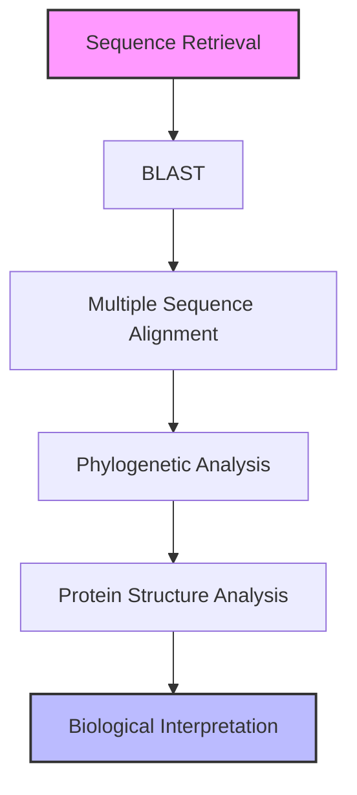

# Mini Project 1 – Comparative Analysis of Human Insulin

## Objective
To investigate the evolutionary conservation of the human insulin gene and protein using publicly available bioinformatics tools.

## Tools Used
- NCBI
- UniProt
- BLAST
- Clustal Omega
- Phylogenetic Tree Tool
- Protein Data Bank
- PyMOL
- Python

## Workflow

